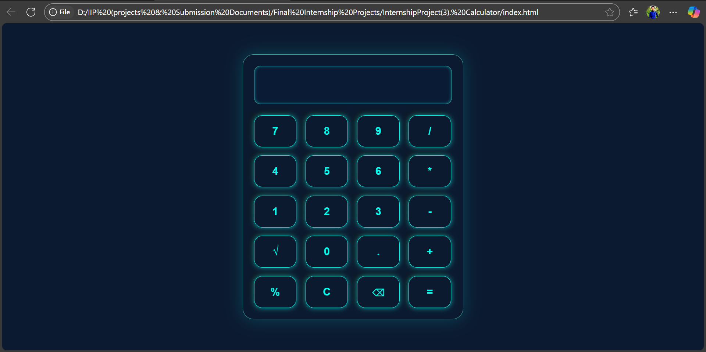

<h1 align="center">🧮 Indian Format Calculator</h1>

  
  
  
 

  A clean, responsive calculator that formats numbers in the <b>Indian numbering system</b> (e.g., <code>12,34,567.89</code>), supports basic & advanced operations, and works smoothly on any device.

---

<h2 align="center">🚀 Live Preview</h2>

  <!-- Live Demo -->
  

  

---

<h2 align="center">✨ Features</h2>

📍 Indian <b>lakh/crore</b> number formatting  
➕ <b>Core operations</b>: +, -, ×, ÷  
🧮 <b>Extra functions</b>: √ (square root), % (percentage), . (decimal)  
🧹 Clear all (C) & backspace (⌫)  
📱 Fully <b>responsive</b> design for mobile & desktop  
🎯 Accessible labels & smooth button interactions

---

<h2 align="center">🛠 Skills & Technologies Used</h2>

| Technology | Purpose |
|------------|---------|
| **HTML5** | Structure & semantic elements |
| **CSS3**  | Styling, responsive layout, button effects |
| **JavaScript (ES6+)** | Calculator logic, Indian number formatting |
| **Intl.NumberFormat('en-IN')** | Indian numbering system |
| **Flexbox & Grid** | Layout arrangement |
| **Responsive Design** | Mobile-first approach |

---

<h2 align="center">📂 Project Structure</h2>

<pre>
Calculator-App/
│── index.html      # HTML structure
│── style.css       # Styling
│── script.js       # Calculator logic
└── assets/
    └── screenshot.png
</pre>

---

<h2 align="center">💡 Future Improvements</h2>

⌨ Keyboard input support  
🧠 Memory functions (MC, MR, M+, M-)  
📐 Scientific mode (x², 1/x, sin, cos, etc.)  
🌙 Dark/Light mode toggle  
📱 Installable PWA version

---

<h2 align="center">👨‍💻 Author</h2>

<b>Shivam Maurya</b> 
🔗 <a href="https://shivammaurya2002.github.io/Calculator-App/">Live Project</a> 
💼 Frontend Developer — HTML | CSS | JavaScript

✨ Made with ❤️ by <b>Shivam Maurya</b> ✨

